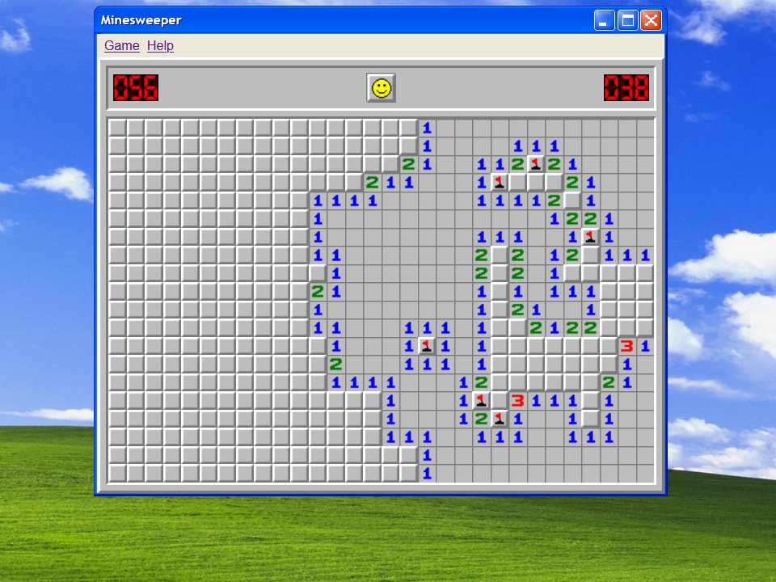

# JSweeper
A faithful browser-based recreation of the classic Windows XP Minesweeper, built with HTML, CSS, and vanilla JavaScript.

## :ledger: Index
- [About](#beginner-about)
- [Additional Information](#page_facing_up-additional-information)
- [Usage](#zap-usage)
  - [Installation](#electric_plug-installation)
- [Development](#wrench-development)
  - [File Structure](#file_folder-file-structure) 
- [FAQ](#question-faq)
- [Gallery](#camera-gallery)
- [Credit/Acknowledgment](#star2-creditacknowledgment)

## :beginner: About
JSweeper adds various quality of life features, such as an included help manual, a suite of various status icons based on your current actions, and a integrated debug mode, which can be toggled in game, as well as many other features that are notably lacking from popular browser versions of this game. 

## :page_facing_up: Additional information
This game requires the latest version of Google Chrome or Firefox to function as intended. I cannot guarantee that this game will function as intended on other browsers, which is due to a lack of development time (this game was completed as a final project for one of my courses). 

If while playing you encounter a bug that cannot be fixed by reloading the page, toggling the debug mode in the game settings and opening inspect element to the console section will allow you to see a report of what the program is computing at any time during your gameplay as well as any errors that are occuring.

## :zap: Usage
This project can be downloaded and run directly off of any web browser. Follow the steps below to set it up. 

###  :electric_plug: Installation
- Clone the repository using the following command:
```
$ git clone https://github.com/amchisa/JSweeper
```
- Open the installation folder and locate the minesweeper.html file (see [file structure](#file_folder-file-structure))
- Run the file on your web browser of choice to begin playing the game.

##  :wrench: Development
This project was built as a final course assignment with a focus on replicating the visual and functional details of the classic Windows XP Minesweeper. It is written using vanilla JavaScript, HTML, and CSS, with no external frameworks or libraries.

If you’re looking to explore how the game logic works, add new features, or tweak the visuals, the codebase is organized to make it as accessible as possible for new contributors. Feel free to fork the repo and experiment.

###  :file_folder: File Structure
Here is the file structure for the project. File descriptions are given below.

```
.
├── assets
│   ├── background.png
│   ├── pseudocode & flowcharts
│   │   └── ...
│   ├── textures
│   │   └── ...
│   └── user_manual.pdf
├── gallery
│   └── ...
├── scripts
│   └── minesweeper.js
├── styles
│   └── minesweeper.css
├── minesweeper.html
└── README.md
```

| No | File Name | Details 
|----|------------|-------|
| 1  | minesweeper.html | Main page
| 2  | textures | Contains game textures and icons
| 3  | pseudocode & flowcharts | Abstract descriptions of game logic
| 4  | gallery | Game screenshots for README
| 5  | user_manual.pdf | Beginner manual accessed through the help link
| 6  | minesweeper.js | Game logic and interactivity
| 7  | minesweeper.css | Styling for the game UI

## :question: FAQ

- **Q: Why doesn’t the game load properly on my browser?**
  
  A: Make sure you're using the latest version of Google Chrome or Firefox. The game isn't tested on Safari or Microsoft Edge, so you may experience visual or functional bugs on unsupported browsers.

- **Q: How do I toggle debug mode?**
  
  A: Open the game settings and enable "Debug Mode." This will provide you with a real-time console log of game operations, which is useful for diagnosing issues or understanding how the game logic works.

- **Q: Why are some textures or icons not displaying?**
   
  A: This may be due to incorrect relative file paths if you're running the game locally. Make sure all folders (`assets`, `scripts`, `styles`) are in the same directory as `minesweeper.html`.

- **Q: Can I modify the game or contribute to development?**
   
  A: Absolutely! Feel free to fork the repository, experiment with new features, or submit pull requests. Any contributions are welcome.

- **Q: Is there support for mobile devices?**
  
  A: The game is primarily designed for desktop browsers. While some functionality may work on mobile, the experience isn't optimized for smaller screens.

- **Q: My clicks don't register or the game freezes. What should I do?**
  
  A: Reload the page. If the issue persists, toggle debug mode and check the browser console for errors. This information can help identify what went wrong.

- **Q: Is there a way to reset the game without refreshing the page?**
  
  A: Yes. Use the `game` button available in the game UI to begin a new round without needing to reload the browser window.

##  :camera: Gallery
Here are a few gameplay screenshots showcasing JSweeper in action:

<p float="left">
  
  
  
  
  
</p>

## :star2: Credit/Acknowledgment
- Credit to @ramantehlan for the README template.
